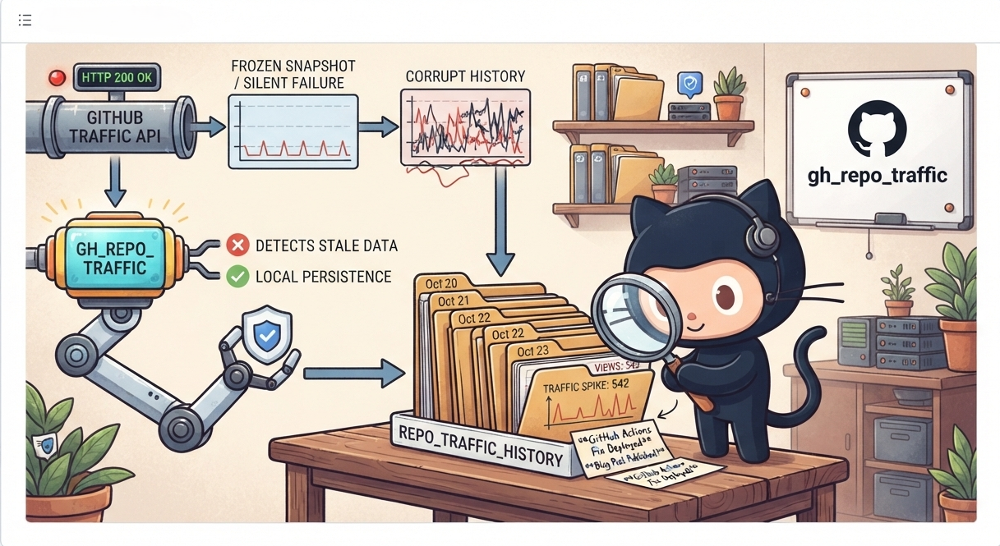
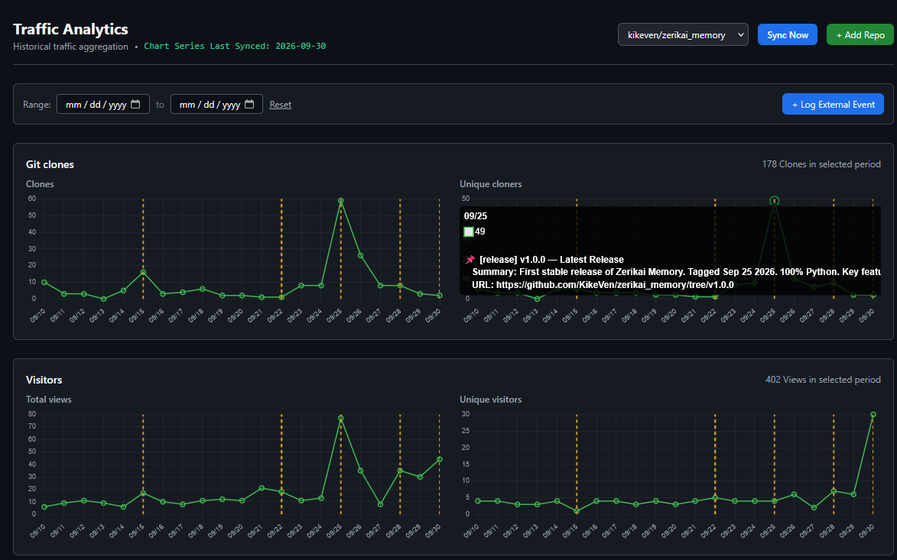
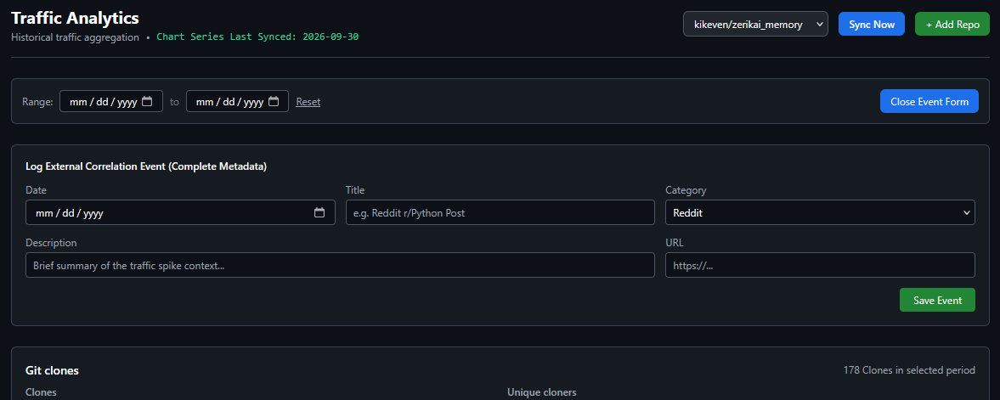
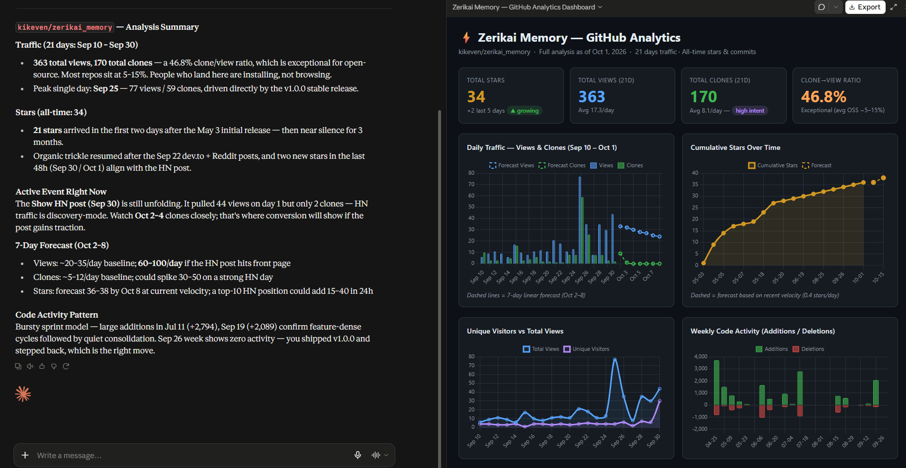

# Repo Traffic Tracker




<p align="center">
GitHub's traffic API returns HTTP 200 with a frozen snapshot and no status page entry. <b>GitHub-Traffic-Analytics</b> fixes the silent failure problem; it persists your traffic data locally, detects stale API responses before they corrupt your history, and lets you annotate traffic spikes with the external events that caused them.
</p>

---

## Table of Contents

* [Repo Traffic Tracker](#repo-traffic-tracker)
  * [Table of Contents](#table-of-contents)
  * [About](#about)
  * [Architecture](#architecture)
  * [Features](#features)
  * [Prerequisites](#prerequisites)
  * [Quick Install](#quick-install)
  * [Usage](#usage)
  * [Roadmap](#roadmap)
  * [License](#license)

---

## About

GitHub's built-in traffic graphs are ephemeral; 14-day rolling window, no history, no context. When a Reddit post or a release drives a clone spike, you have no way to know why it happened or compare it to the last time.

`GitHub-Traffic-Analytics` gives you:

* **Persistent local history:** daily views, clones, referrers, and paths stored in SQLite
* **Event correlation:** annotate your traffic timeline with the external events that moved it
* **Staleness detection:**  skips writes when the GitHub API returns an identical frozen snapshot, so bad data never enters the historical record
* **Two interfaces:** a web dashboard for humans and an MCP server for IDE agents

---

## Architecture

```text
GitHub API
    │
    ▼
ingester.py  ──── staleness check ────► skip + warn (upstream_stale)
    │
    ▼
SQLite (app.db)
    │
    ├──► FastAPI (main.py) ──► Jinja2 templates ──► Web UI
    │         │
    │         └──► REST API (/api/metrics, /api/events, /api/sync)
    │
    └──► MCP Server (mcp_server.py) ──► IDE agents (Cursor, VS Code)
```

**Key files:**

| File | Role |
|------|------|
| `main.py` | FastAPI app, REST endpoints, Pydantic models |
| `ingester.py` | GitHub CLI data fetch, staleness detection, sync logic |
| `database.py` | SQLite init, `DB_PATH` resolution, schema setup |
| `mcp_server.py` | MCP tools for LLM-driven traffic analysis |
| `templates/index.html` | Main dashboard: Alpine.js + Chart.js |
| `templates/source_detail.html` | Per-referrer/path historical chart |

---

## Features

**Traffic ingestion:**

* Fetches views, clones, unique visitors, and unique cloners via the GitHub CLI
* Detects and skips upstream-stale snapshots (identical payload = no write)
* `UNIQUE` constraint on `(repo_id, logged_date, source_type, source_or_path)` prevents duplicate records
* Background task execution: sync requests return immediately, ingestion runs async

**Web dashboard:**

* Multi-repo support: add and switch between repos from the UI
* Date range filtering on all charts
* Four traffic charts: views, unique visitors, clones, unique cloners
* Referrers and top paths with per-source historical drill-down
* Event annotations rendered as dashed vertical lines on the charts
* Tooltip footer shows matching event titles per date



**External event tracking:**

* Log Reddit posts, DEV.to articles, releases, and any external event with full CRUD
* Events are stored with `title`, `category`, `url`, `description`, and `event_date`
* Correlate traffic spikes with the content or release that caused them



**MCP server:**

* `get_repo_metrics`: daily traffic for a date range
* `list_events`: all logged external events with IDs
* `log_external_event`: create a new event (all fields required)
* `update_external_event`: edit an existing event by ID
* `delete_external_event`: remove an event by ID
* `query_sql`: raw `SELECT` access to the SQLite database
* `trigger_ingester`: on-demand sync from any MCP-connected IDE


_Claude Desktop: GitHub repository traffic analysis with the MCP server connected._

**Analytics skill (`gh-analytics-skill/SKILL.md`):**

An agent skill that turns the raw MCP tools into a guided analysis workflow. When exposed to an MCP-connected agent, it:

* Always calls `trigger_ingester` first, so answers come from fresh data — never cached
* Separates organic clones from CI/bot loops (`clone_ratio ≥ 8.0`)
* Maps deep-funnel path conversion (issues, PRs, discussions, dependency pages) and normalized referrer buckets (Reddit, Hacker News, Google, GitHub)
* Correlates traffic and star spikes with logged external events, validating unknowns via Tavily
* Synthesizes KPIs, anomalies, star velocity, and code churn — optionally as a D3.js HTML dashboard

**How to use it:** register the `github-analytics` MCP server in your client, then make the skill file available to your agent (e.g., drop it into your skills directory). The skill triggers automatically on requests like "how's my repo traffic this month?" or "why did stars spike last week?". See `gh-analytics-skill/SKILL.md` for the full query templates, schema reference, and rules.

---

## Prerequisites

**1. Python 3.10+:**

**2. GitHub CLI**: required for all data ingestion

```bash
# macOS
brew install gh

# Windows
winget install --id GitHub.cli

# Linux
# https://cli.github.com/
```

**3. Authenticate the GitHub CLI:**

```bash
gh auth login
```

Follow the prompts. Select HTTPS and authenticate via browser. Verify with:

```bash
gh auth status
```

---

## Quick Install

```bash
# 1. Clone the repo
git clone https://github.com/KikeVen/GitHub-Traffic-Analytics.git
cd GitHub-Traffic-Analytics

# 2. Create and activate a virtual environment (Python 3.10+)
python -m venv .venv
source .venv/bin/activate      # Windows: .venv\Scripts\activate

# 3. Install dependencies
pip install -r requirements.txt

# 4. Initialize the database and run the first sync
python ingester.py

# 5. Start the web server
# uvicorn main:app --reload
python main.py
```

Open `http://localhost:8000` in your browser.

**MCP server (for IDE agents):**

```bash
python mcp_server.py
```

Add to your MCP client config (e.g., `mcp.json` in **Claude Desktop**):

```json
{
  "mcpServers": {
    "github-analytics": {
      "command": "D:\\Users\\<username>\\<file_path>\\GitHub-Traffic-Analytics\\venv\\Scripts\\python.exe",
      "args": [
        "D:\\Users\\<username>\\<file_path>\\GitHub-Traffic-Analytics\\mcp_server.py"
      ]
    }
  }
}
```

---

## Usage

**Add a repository via the web UI:**

Open the dashboard, enter `owner/repo` (e.g., `<user>/<repo>`) and click **Add Repo**. The ingester runs in the background and populates the charts.

**Sync on demand:**

Click **Sync** in the dashboard, or trigger via MCP:

```text
trigger_ingester(repo="<user>/<repo>")
```

**Log an external event:**

Use the dashboard form or the MCP tool:

```text
log_external_event(
    repo="<user>/<repo>",
    date="2026-09-22",
    title="Reddit post: RAG can rank but it can't judge",
    category="reddit",
    url="https://reddit.com/r/Rag/...",
    description="Posted to r/Rag, 14 upvotes, 13 comments."
)
```

The event appears as an annotated vertical line on all traffic charts.

**Query via MCP (IDE agent):**

```text
get_repo_metrics(repo="<user>/<repo>", start_date="2026-09-10", end_date="2026-09-27")
query_sql(query="SELECT date, views_count, clones_count FROM daily_traffic WHERE repo_id = 1 ORDER BY date DESC LIMIT 14")
```

---

## Roadmap

* [ ] Chart images returned directly from MCP tools (`ImageContent` / base64 PNG) for inline rendering in Cursor and VS Code
* [ ] `get_traffic_sources` MCP tool: referrers and paths without raw SQL
* [ ] Automatic release ingestion from GitHub Releases API into `releases_history`
* [ ] PostgreSQL backend option for multi-user or higher-volume setups
* [ ] Stars history chart on the dashboard

---

## License

MIT: see [LICENSE](LICENSE) for details.

**Maintainer:** [@KikeVen](https://github.com/KikeVen)